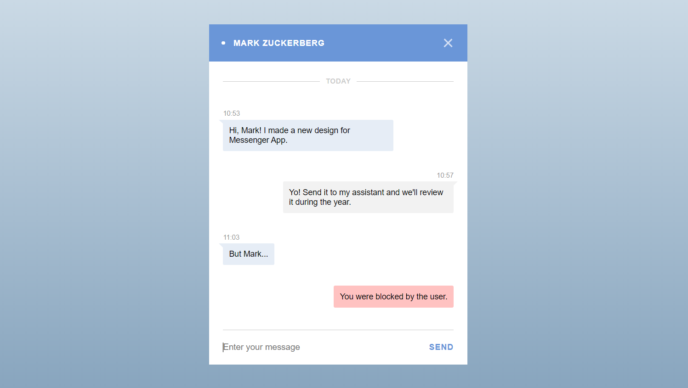

## Style Guide

### 🎯 Design Goal

#### 🎨Color

- **Blue Color** `#6a96d8`
- **Light Blue Color** `#e6edf6`
- **Light Grey Color** `#f2f2f2`
- **Red Color** `#ffc2c1`
- **Grey Text Color** `#999999`
- **Light Grey Text Color** `#cccccc`
- **Dark Text Color** `#000000`

#### 🌌Font

- **Roboto**
