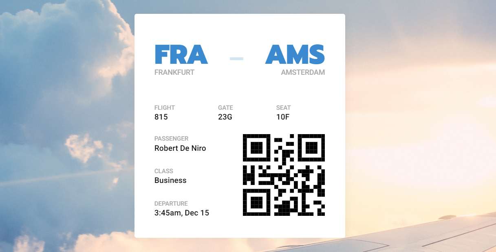

## Style Guide

### ✅ Done | [Live demo](https://arrizkyhp.github.io/frontloops-challenges/completed-challenges/markup/loop-1_Step-5_Boarding-Pass/)

---

### 🎯 Design Goal

#### 🎨Color

- **Blue Color** `#3b8acf`
- **Light Blue Color** `#d3e6f4`
- **Dark Color** `#000000`
- **Grey Color** `#b0b0b0`

#### 🌌Font

- **Roboto**
- **Prompt**
